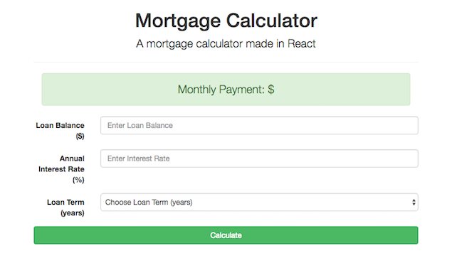
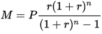

# React Mortgage Calculator
> Calculates monthly mortgage payments with user input of annual interest rate and selection of loan term of 15 or 30 years.

This was my tenth project at Origin Code Academy. This mortgage calculator was made using React. React is a JavaScript library for building user interfaces.



## Background
The calculations in this React app were created by using the following mathematical formula; where M is the monthly payment, P is the principal, r is the monthly interest rate (calculated by dividing the annual interest rate by 12), and n is the number of payments, in this case, the number of loan paying months (either 180 [15 years] or 360 [30 years]).




## Approach

I took a mobile-first approach with this app and created a responsive design contingent on the dimensions of the device screen.

## Installation

Download all associated files and load them up in your favorite text editor!

## Development setup

```
npm install
```
```
npm run build
```
```
npm start
```

## Contributing

* Please follow the AirBnB styleguide.

* Open a pull request, all contributions will be considered.

## Contact Information

Twitter: [@adriftinthesea](https://twitter.com/adriftinthesea)

Email: z@zamarise.com

GitHub: [https://github.com/zamarise](https://github.com/zamarise/)
